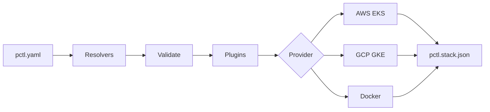

---
hide:
  - navigation
---

# :material-kubernetes: PCTL

**Orquestador declarativo de pods para despliegues de contenedores multi-nube.**

Un YAML. Multiples proveedores. Cero vendor lock-in.

---

## :material-rocket-launch: Que es PCTL?

PCTL toma un unico archivo de configuracion y despliega tus servicios en contenedores a **AWS EKS**, **Google Cloud GKE** o **Docker** (local y remoto via SSH). Se encarga de construir imagenes, subir a registries, crear manifiestos de Kubernetes, gestionar estado y limpiar recursos.

```yaml
name: my-app

services:
  api:
    image: ./Dockerfile
    registry: ghcr.io/myorg/api
    scale:
      replica: [2, 10]
      cpu: 256m
      memory: 512Mi
    ports:
      - 3000
    health:
      interval: 30
      command: "curl -f http://localhost:3000/health"
    provider:
      name: aws
      options:
        cluster: my-cluster
        namespace: production
```

```bash
pctl deploy     # Construir, subir, desplegar
pctl destroy    # Limpiar todo
```

---

## :material-star-four-points: Caracteristicas

<div class="grid cards" markdown>

-   :material-file-document-edit:{ .lg .middle } **Configuracion Declarativa**

    ---

    Define servicios, escalado, almacenamiento, health checks y proveedores en un unico archivo YAML. Sin scripts imperativos.

-   :material-cloud-outline:{ .lg .middle } **Multi-Proveedor**

    ---

    Despliega la misma configuracion a **AWS EKS**, **Google Cloud GKE** o **Docker** (local + SSH). Mezcla proveedores en un mismo stack.

-   :material-variable:{ .lg .middle } **Resolvers Dinamicos**

    ---

    `${env:KEY}` `${ssm:/path}` `${cfn:export}` `${self:custom.value}` - Resuelve valores desde variables de entorno, AWS SSM, CloudFormation o la propia configuracion.

-   :material-puzzle:{ .lg .middle } **Pipeline de Plugins**

    ---

    Sistema extensible de plugins. Resolver, validar, transformar, desplegar - cada paso es un plugin que puedes reemplazar o extender.

-   :material-delta:{ .lg .middle } **Despliegues por Diff**

    ---

    Genera un fingerprint de cada servicio. Solo reconstruye y redespliega lo que realmente cambio. Los servicios sin cambios se omiten.

-   :material-delete-sweep:{ .lg .middle } **Destroy Limpio**

    ---

    El archivo de estado rastrea cada recurso creado. Destroy elimina deployments, servicios, volumenes, imagenes, namespaces y secrets. Espera confirmacion de eliminacion.

-   :material-docker:{ .lg .middle } **Agnostico de Registry**

    ---

    Sube a ECR, Artifact Registry, GHCR, Docker Hub o cualquier registry OCI. Registries privados con imagePullSecrets.

-   :material-arrow-up-down:{ .lg .middle } **Auto-Scaling**

    ---

    `replica: [0, 100]` crea un HorizontalPodAutoscaler. Replicas fijas para workers. Scale-to-zero para servicios inactivos.

</div>

---

## :material-download: Inicio Rapido

```bash
npm install -g @arcaelas/pctl
```

```bash
pctl deploy -c pctl.yaml              # Desplegar todos los servicios
pctl deploy -c pctl.yaml --name staging  # Sobreescribir nombre del stack
pctl destroy -c pctl.yaml             # Destruir todos los recursos
```

---

## :material-sitemap: Arquitectura



---

## :material-compare: Proveedores de un Vistazo

| Caracteristica | AWS (EKS) | GCP (GKE) | Docker |
|---|:---:|:---:|:---:|
| Kubernetes | :material-check: | :material-check: | :material-close: |
| Auto-scaling (HPA) | :material-check: | :material-check: | :material-close: |
| RBAC | :material-check: | :material-check: | :material-close: |
| Almacenamiento Persistente | EBS / EFS | PD / Filestore | Volumes |
| Auth de Registry | ECR auto | AR auto | Manual |
| Despliegue Remoto | - | - | SSH |
| Health Checks | Liveness Probe | Liveness Probe | Docker Health |
