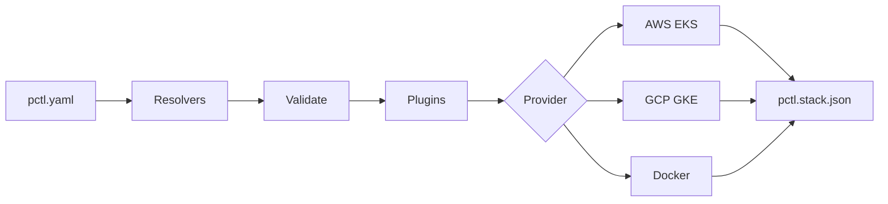

---
hide:
  - navigation
---

# :material-kubernetes: PCTL

**Declarative pod orchestrator for multi-cloud container deployments.**

One YAML. Multiple providers. Zero vendor lock-in.

---

## :material-rocket-launch: What is PCTL?

PCTL takes a single configuration file and deploys your containerized services to **AWS EKS**, **Google Cloud GKE**, or **Docker** (local and remote via SSH). It handles building images, pushing to registries, creating Kubernetes manifests, managing state, and cleaning up resources.

```yaml
name: my-app

services:
  api:
    image: ./Dockerfile
    registry: ghcr.io/myorg/api
    scale:
      replica: [2, 10]
      cpu: 256m
      memory: 512Mi
    ports:
      - 3000
    health:
      interval: 30
      command: "curl -f http://localhost:3000/health"
    provider:
      name: aws
      options:
        cluster: my-cluster
        namespace: production
```

```bash
pctl deploy     # Build, push, deploy
pctl destroy    # Clean everything
```

---

## :material-star-four-points: Features

<div class="grid cards" markdown>

-   :material-file-document-edit:{ .lg .middle } **Declarative Configuration**

    ---

    Define services, scaling, storage, health checks, and providers in a single YAML file. No imperative scripts.

-   :material-cloud-outline:{ .lg .middle } **Multi-Provider**

    ---

    Deploy the same config to **AWS EKS**, **Google Cloud GKE**, or **Docker** (local + SSH). Mix providers in one stack.

-   :material-variable:{ .lg .middle } **Dynamic Resolvers**

    ---

    `${env:KEY}` `${ssm:/path}` `${cfn:export}` `${self:custom.value}` - Resolve values from environment, AWS SSM, CloudFormation, or the config itself.

-   :material-puzzle:{ .lg .middle } **Plugin Pipeline**

    ---

    Extensible plugin system. Resolve, validate, transform, deploy - each step is a plugin you can replace or extend.

-   :material-delta:{ .lg .middle } **Diff-Based Deploys**

    ---

    Fingerprints each service. Only rebuilds and redeploys what actually changed. Unchanged services are skipped.

-   :material-delete-sweep:{ .lg .middle } **Clean Destroy**

    ---

    State file tracks every resource created. Destroy removes deployments, services, volumes, images, namespaces, and secrets. Waits for confirmation.

-   :material-docker:{ .lg .middle } **Registry Agnostic**

    ---

    Push to ECR, Artifact Registry, GHCR, Docker Hub, or any OCI registry. Private registries with imagePullSecrets.

-   :material-arrow-up-down:{ .lg .middle } **Auto-Scaling**

    ---

    `replica: [0, 100]` creates a HorizontalPodAutoscaler. Fixed replicas for workers. Scale-to-zero for idle services.

</div>

---

## :material-download: Quick Start

```bash
npm install -g @arcaelas/pctl
```

```bash
pctl deploy -c pctl.yaml              # Deploy all services
pctl deploy -c pctl.yaml --name staging  # Override stack name
pctl destroy -c pctl.yaml             # Destroy all resources
```

---

## :material-sitemap: Architecture



---

## :material-compare: Providers at a Glance

| Feature | AWS (EKS) | GCP (GKE) | Docker |
|---|:---:|:---:|:---:|
| Kubernetes | :material-check: | :material-check: | :material-close: |
| Auto-scaling (HPA) | :material-check: | :material-check: | :material-close: |
| RBAC | :material-check: | :material-check: | :material-close: |
| Persistent Storage | EBS / EFS | PD / Filestore | Volumes |
| Registry Auth | ECR auto | AR auto | Manual |
| Remote Deploy | - | - | SSH |
| Health Checks | Liveness Probe | Liveness Probe | Docker Health |
